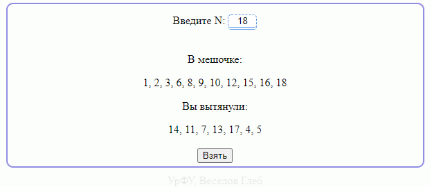

# Описание:
Программа принимает на вход значение N, после выводит исходный ряд, а при нажатии на кнопку выбирает случайное число из этого ряда, как показано на скриншоте:

*Замечатение: Если ввести нецелочисленное значение N, то оно автиматически возьмётся за 10. Если ввести N <= 1, то программа не выведет ряд*

# Открытие и использование:
* Необходимо открыть файл ___index.html___, чтобы запустить программу. Откроется бразуер, где в новой вкладке будет находиться интерфейс программы, показанный на скриншоте выше. 
*желательно открывать через браузер Google Chrome либо Yandex*

* В самом верху, после слов "Введите N", находится поле, куда и нужно ввести значение N, большее 1. 
* После чего программа реактивно выведет исходный ряд от 1 до N. 
* Следует нажать на кнопку "Взять", чтобы вытащить из исходного ряда случайное число, тем самым образовав новый ряд
# Среда программирования: 
Программа построена на чистом JavaScript с использованием разметки html и стилей css. Открывать можно в любом удобном редакторе, который поддерживает данные форматы файлов, для примера, *Visual Code Studio*, *Notepad++* или *блокнот*. Весь пользовательский интерфейс представлен в файле index.html, через него и осуществляется управление программой. Введенное значение берётся с интерфейса с помощью js/main.js реактивным способом через прослушивание действий. Оно, после проверки условий на величину и целочисленность, поступает в класс js/Calc.js, где и формирует массив (ряд), который моментально выводится в интерфейс. После нажатия на кнопку "Взять" тот же класс берет случайное допустимое число, которое является индексом исходного массива, и по нему достает элемент, добавляя его в новый массив (ряд), который так же моментольно, отображается в интерфейсе.
